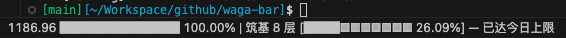

# Salary Tracker (waga-bar)

一个在状态栏实时展示当天已获得工资的 VS Code 扩展。它根据配置的月薪、入职时间与当前北京时间计算当日已获得的工资、当前修真境界层进度，并在状态栏显示直观的进度条与百分比。



## 功能

- 在状态栏实时显示当日已获得工资（按工作时间、午休扣除计算）。
- 显示当日工资的进度条与百分比（不超过 100%）。当日收益达到上限时，在状态栏显示“今日收益已最大”的提示。
- 根据配置的入职时间计算当前“境界”与所在层数（每 10 层为一个境界），并显示层内进度条。
- 支持中/英文本地化（i18n）。

### 月份与境界的关系

每工作一个月视为进阶一层（layer）。从入职月份开始计数，已工作的月数等于当前层的编号（从 0 开始）。每 10 层为一个境界（realm），例如：

- 已工作 0-9 个月 -> 第 1 个境界（realm index = 0），层数 1-10（layerInRealm 从 0 到 9，展示时会加 1）
- 已工作 10-19 个月 -> 第 2 个境界（realm index = 1），层数 1-10

插件会显示 `currentRealm`（境界名）和 `layerInRealm + 1`（当前境界内的层数，从 1 开始显示）。

## 设置（Settings）

通过 `contributes.configuration` 在 VS Code 中提供以下设置（路径均以 `salary.` 开头）：

- `salary.language` (string) — 本地化语言，默认 `en`，可用值：`zh`、`en`。
- `salary.refreshInterval` (number) — 状态栏刷新间隔（毫秒），默认 `1000`。
- `salary.monthly` (number) — 月薪（默认 `10000`）。
- `salary.entryDate` (string) — 入职日期（格式：`YYYY-MM-DD`），默认 `2024-05-23`。
- `salary.realmNames.zh` (array) — 中文境界名称数组（每十层一个境界）。
- `salary.realmNames.en` (array) — 英文境界名称数组。

示例（在 settings.json 中）：

```json
"salary.language": "zh",
"salary.monthly": 12000,
"salary.entryDate": "2024-05-23",
"salary.refreshInterval": 2000
```

## 开发流程（开发者）

下面说明如何在本地构建、运行、测试与调试扩展。

1. 安装依赖

```bash
npm install
```

2. 编译扩展与测试代码

```bash
npm run compile-tests   # 编译 TS 测试到 out/
npm run compile         # 使用 webpack 打包扩展到 dist/
```

3. 运行集成测试（使用 VS Code 测试宿主）

```bash
npm test
```

说明：`npm test` 会下载 package.json 中 `engines.vscode` 指定的 VS Code 版本作为测试宿主（下载一次后会缓存到 `.vscode-test/`）。如果本地出现 Electron 崩溃（SIGTRAP），请优先在 CI（或 headless Linux）运行测试。

4. 快速运行 Node-only 单元测试（不依赖 VS Code）

```bash
npm run compile-tests
node out/test/unit.extension.test.js
```

5. 开发时实时观察（watch）

```bash
npm run watch       # 打包 watch
npm run watch-tests # 测试 ts watch
```

6. 在 VS Code 中调试扩展

- 打开项目，然后按 F5（或在调试面板选择 'Launch Extension'）启动 Extension Development Host。
- 在 `src/` 中设置断点，调试器会在扩展宿主中命中断点。

7. 自动修复样式

```bash
npm run lint -- --fix
```


## 本地化

请参考 `src/i18n.ts` 添加或修改本地化文案（目前支持 zh/en）。

## 许可证

本项目采用 Apache License 2.0（Apache-2.0），详情见仓库根目录的 `LICENSE` 文件。请将 `LICENSE` 中的版权持有人替换为你的姓名或组织名称。
